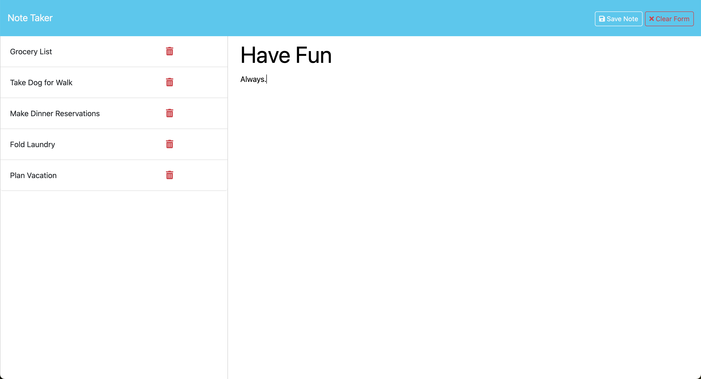

# Note Taker

# Table of Contents
1. [Description](#Description)
2. [Installation](#installation)
3. [Usage](#tusage)
4. [License](#license)
5. [Contributors](#contributors)
6. [Testing](#testing)
7. [Questions](#questions)

## Description
Note Taker is a an app that lets a user create new notes, view any notes that were taken previously, , and delete any notes stored. It will save these notes on the server.

## Installation
This app works in any browser and no installation is required.

## Usage
This app is useful for jotting down some quick notes when in need.

## License
This is an MIT License.

## Questions?
If you have any questions, feel free to send me an email at kzapcic at gmail.

